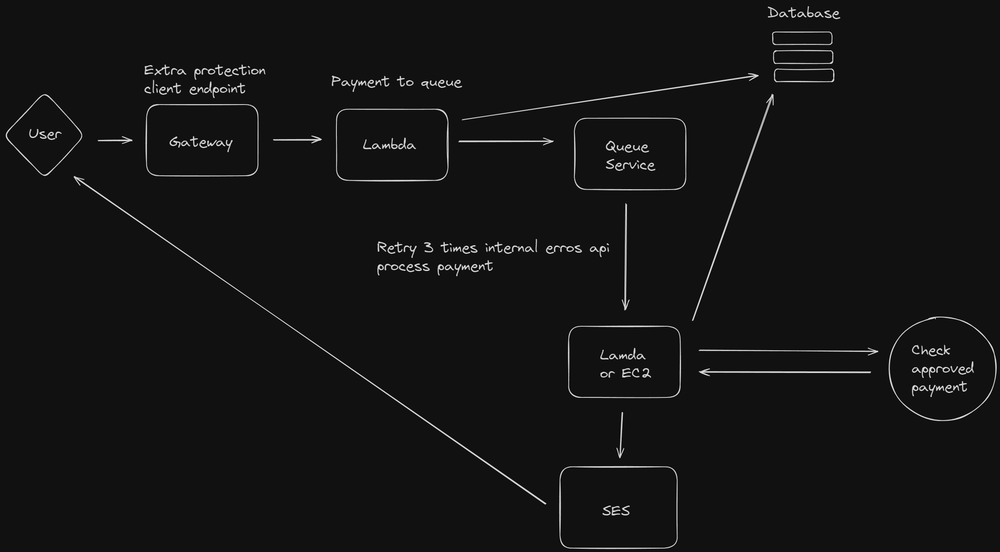

# Sistem design for a simple payment system - GO + TERRAFORM + AWS

⚠️ - Under development

## Functional Requirements
### Payment Processing:
- The system must be able to receive payment requests from users.
The Gateway must provide an extra layer of protection for transactions.
The Lambda must process the request and place it in a queue for asynchronous processing.
### Queue Service:
- The system must enqueue payments for later processing.
There must be a queue service that temporarily stores payments.
### Batch Payment Processing:
- The system must process payments from the queue.
If internal errors occur, the system must retry processing up to three times before failing.
### Database Integration:
- The system must store transaction information in the database.
The database must be updated after each payment processing attempt.
### Payment Verification:
- The system must check if the payment was approved after processing.
There must be logic to verify and confirm payment approval.
### Payment Notification:
- The system must notify the user about the payment status.
The notification must be sent via SES (Simple Email Service).

## Non-Functional Requirements
### Performance:
- The system must be able to process a large number of transactions simultaneously without significant performance degradation.
The gateway response time must not exceed 2 seconds.
### Scalability:
- The system must be horizontally scalable to accommodate increases in transaction volume.
It must be possible to add more Lambda or EC2 instances as needed.
### Reliability:
- The system must have high availability, with an uptime of 99.9%.
There must be retry and fallback mechanisms to ensure transactions are not lost in case of temporary failures.
### Security:
- The system must ensure the security of payment data using end-to-end encryption.
There must be robust authentication and authorization for all critical operations.
### Maintainability:
- The system code must be modular and well-documented to facilitate maintenance and future updates.
There must be detailed logs of all operations to facilitate auditing and debugging.
### Compliance:
- The system must comply with relevant standards and regulations, such as PCI DSS (Payment Card Industry Data Security Standard).
### Resilience:
- The system must be able to automatically recover from failures.
There must be continuous monitoring and alerts for failures and anomalous performance.

